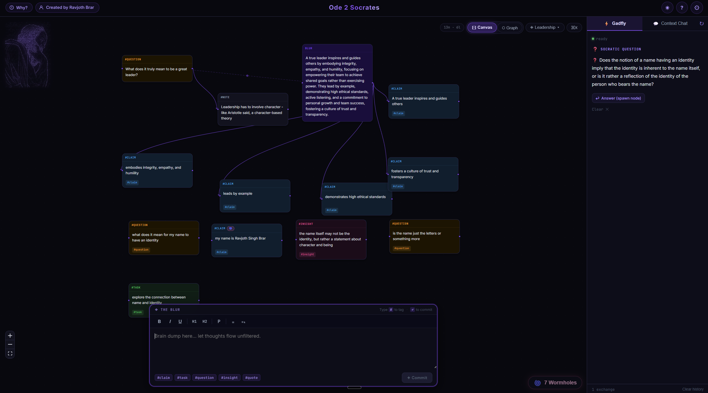

# Ode 2 Socrates

> *"The unexamined thought is not worth keeping."* — Socrates (probably)

A spatial, Socratic note-taking app. **[Try it live →](https://ravjothbrar.com/Ode2Socrates/)**

> Your thoughts never leave your device. Everything is stored locally in your browser — no accounts, no servers, no data collection. What you write here is yours alone.

## What is it?

Ode 2 Socrates is a browser-based reflection tool — built to help you look inward, question your assumptions, and form arguments with AI assistance. It maps your thinking as a spatial graph, revealing connections and blind spots you didn't know were there.

> *"A space to find out what you think, how you think, and who you are."*

## How it works

- **The Blur** — a floating brain-dump input at the bottom of the canvas. Type anything: stream of consciousness, half-formed ideas, ranting thoughts. Hit Enter to commit a thought as a node.
- **The Canvas** — every committed thought becomes a node on a spatial canvas. Nodes connect automatically when ideas are related, building a live map of your thinking.
- **The Gadfly** — the Socratic Engine in the right sidebar. It automatically fires challenges as you type: a probing question exposing your assumptions, a counter-argument, or a reframe you hadn't considered.
- **Context Chat** — ask direct questions about your notes; the AI has full context of everything on your canvas.
- **Wormholes** — link nodes across different Spaces to surface unexpected connections between separate threads of thought.

## Privacy

All data is stored in your browser's IndexedDB. Nothing is transmitted to any server — not your notes, not your graph, not your thinking. The only external call made is to the Groq API (for the Socratic Engine), using your own API key, sent directly from your browser.
